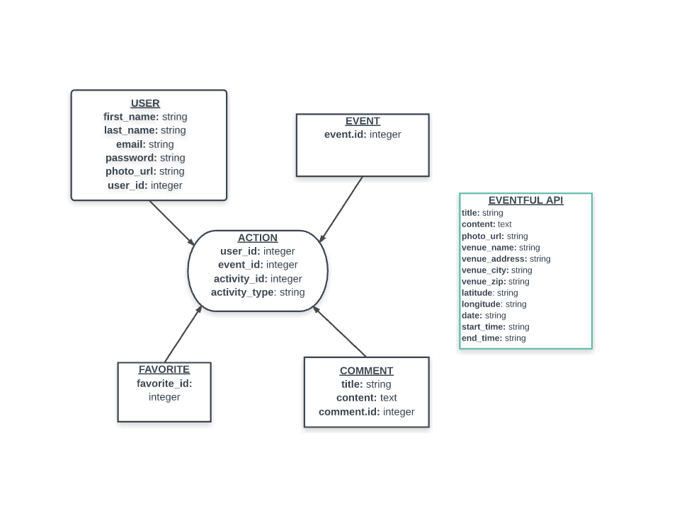
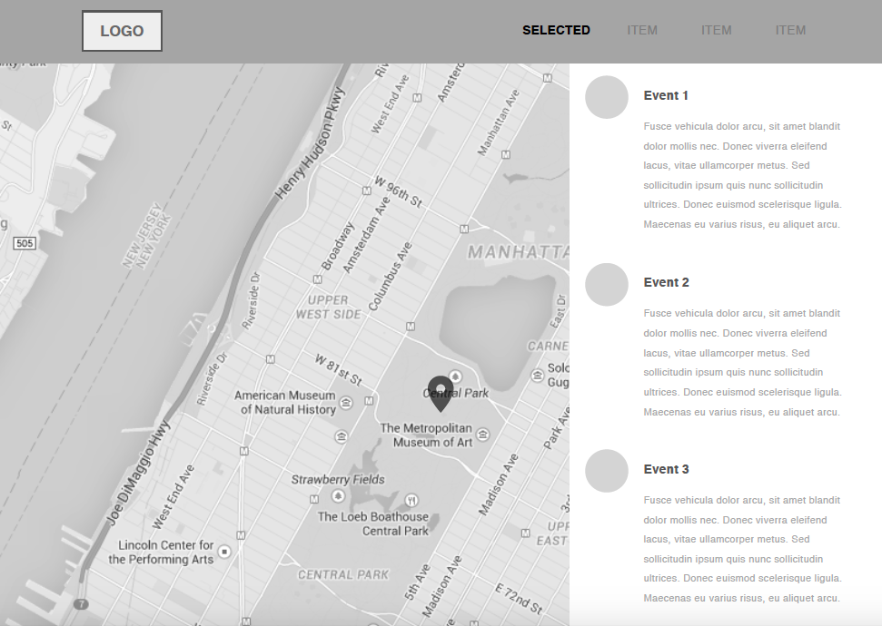
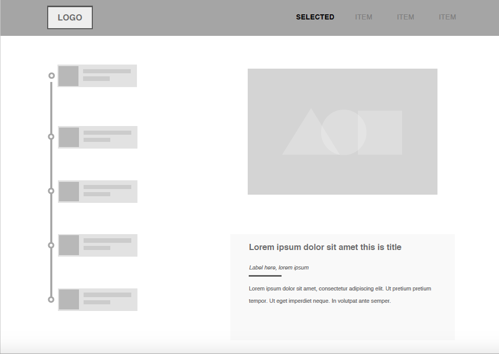
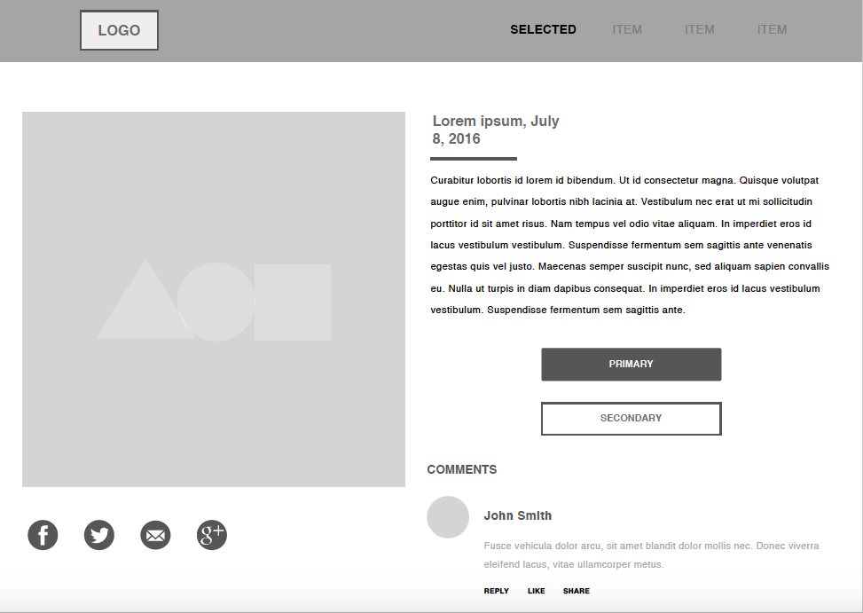

**An application for finding local events**

## Getting Started
1. Clone this repo
2. In the terminal type `npm install & bundle install`
3. Then type `rails db:setup`
4. Next, type `rails s`
5. Now, navigate to `localhost:3000`

You should be greeted by the Eventr splash page

## Features
- The user can signup/signin
- The user can view events based on their current location
- The user can sort events based on day or category
- The user can see event details
- The user can make comments on events
- The user can delete comments they've made on events
- The user can favorite/unfavorite events
- The user can view their profile page
- The user can see their favorites and comments on their profile page
- The user can edit their account information

## Technologies
- Ruby on Rails backend
- Devise user authentication
- AngularJS frontend
- Google Maps API
- Google Reverse Geolocation API
- Google Static Maps API
- Eventful Event API
- Bootstrap responsive design

## ERDS

### Original ERD

### Final ERD

## Wireframes

## User Stories
[Trello Board](https://trello.com/b/RYYZ9RRd/project-4)
